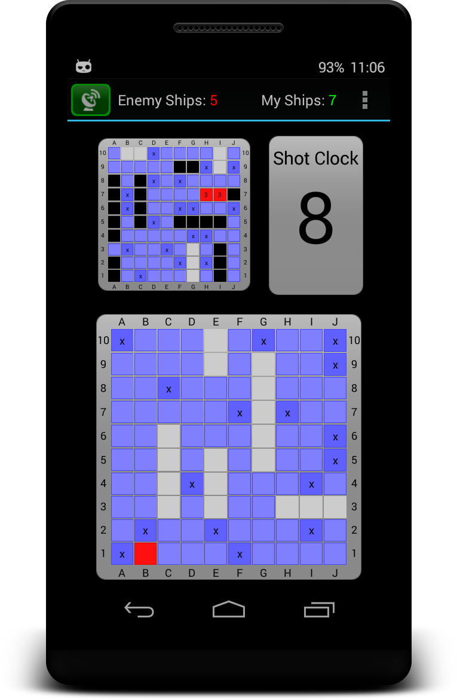
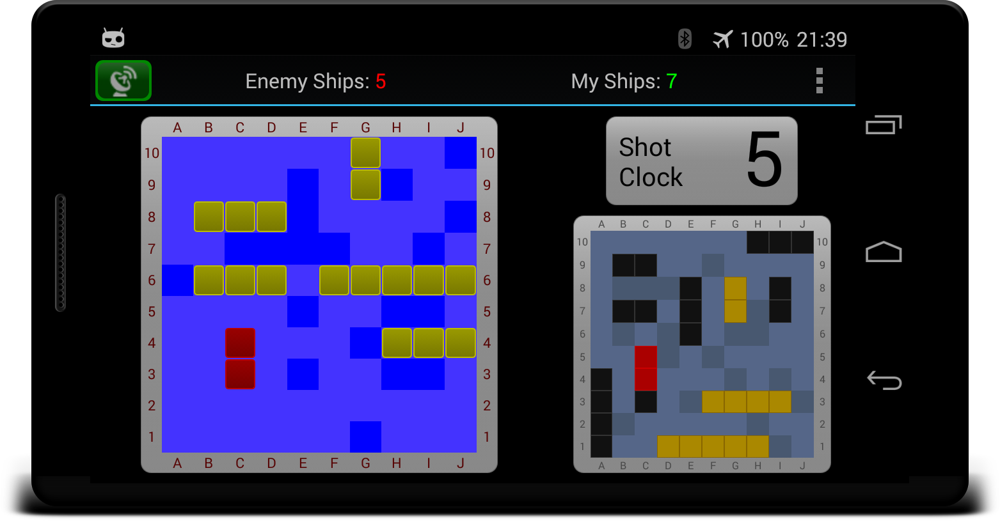

#  ShipsDroid (BT)

P2P [Battleship Game](http://en.wikipedia.org/wiki/Battleship_%28game%29) using Bluetooth

## Some Notes

* This is free and open software developed for **research and educational** purposes only
* Two player p2p battleship game
* Based on Battleship (Swing/FX8 desktop version)
* English / German language supported
* Tested width Android 4.4.4 (API Level 19)
* Devices must already be paired

## TODO

* Game Settings Activity
  * ShotClock timeout
  * Other settings

## Screenshots

