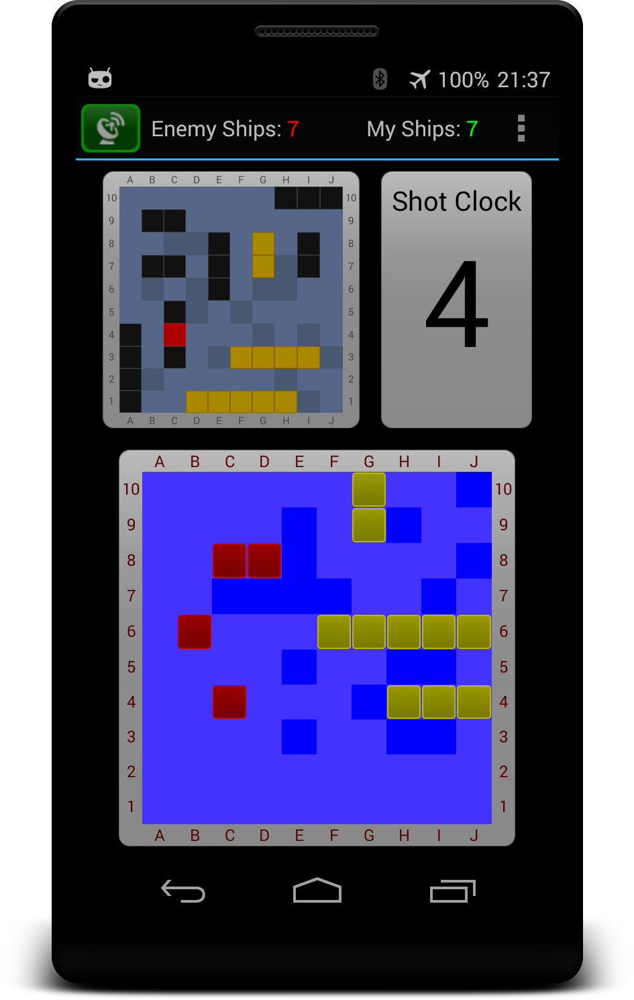

#  ShipsDroid

Android Project: P2P [Battleship Game](http://en.wikipedia.org/wiki/Battleship_%28game%29) using Wifi-Direct

## Main purpose

Test Wifi-Direct as an alternative to Bluetooth to connect two or more Android Phones directly

## Some Notes

* This is free and open software developed for **research and educational** purposes only
* Two player p2p battleship game
* Based on Battleship (Swing desktop version)
* Using Wifi-Direct on Data Link Layer
* English / German language supported
* Tested width Android 4.4.4 (API Level 19)
* Development time: ca. 40 houres
* **Bluetooth version on [bluetooth branch](../../tree/bluetooth)** (Works better than Wifi-Direct)

## TODO

* Game Settings Activity
  * ShotClock timeout
  * Other settings

* Landscape layout for tablet use

## Screenshot

